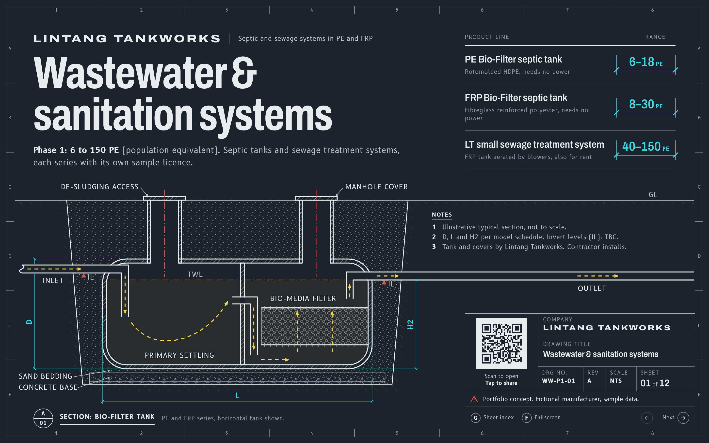

# Lintang Tankworks wastewater deck — portfolio concept

An offline, single-file interactive sales deck for the septic tanks and small sewage treatment systems
of "Lintang Tankworks" (Phase 1: 6 to 150 population equivalent, PE), drawn as twelve CAD-style
drawing sheets. It includes a selector that picks a model for a given PE and site and draws that tank
to its real proportions, then opens a pre-filled WhatsApp enquiry.



**This is a portfolio piece, and Lintang Tankworks is a fictional manufacturer.** The deck began as a
speculative concept for a real Malaysian wastewater manufacturer's Upwork job post. That client hired
someone else, so it was rebuilt around a fictional brand with sample data throughout. Every sheet,
the title block and the sharing UI say so: "Portfolio concept. Fictional manufacturer, sample data."
Every dimension and capacity is synthetic, derived from the PE rating by an authored sizing rule
(`scripts/product-rule.mjs`, see [docs/SOURCES.md](docs/SOURCES.md)). The brand, model codes, licence
numbers and company facts are invented too. No real company is named anywhere in the deck.

## Portfolio pack

Everything needed for a portfolio entry is in [`portfolio/`](portfolio/):

| File | What it is |
|---|---|
| [`case-study.md`](portfolio/case-study.md) | The case study: brief, what was built, process, tech and quality, and the fictional-data note. Plain text, ready to paste into Upwork, Behance or a website. |
| `cover-desktop.png` | Sheet 01, the cover, 2880 x 1800 (1440 x 900 at 2x). |
| `selector-desktop.png` | Sheet 10, the selector filled in (20 PE, deep burial: LF-20V), 2880 x 1800. |
| `drawing-desktop.png` | Sheet 07, the FRP anchorage detail and schedule, 2880 x 1800. |
| `phone-trio.png` | Sheets 01, 10 and 05 on a phone, side by side on the deck's ground colour, 1600 px wide. |
| `capture.mjs` | Regenerates the four images from `dist/index.html` (`npm run portfolio:images`). |

The images are real renders of the built deck in Playwright's Chromium, not mock-ups. The QR code in
their title blocks encodes the deck's own URL: the `SITE_URL` it was built with, or a fictional
`https://lintang-tankworks-deck.example/` when there is none. After deploying, rebuild with your real
`SITE_URL` and run `npm run portfolio:images` again so the QR in the images opens the live deck.

## Run it locally

Requires Node.js 20 or later.

```bash
npm install
npx playwright install chromium   # once: for the e2e tests and the portfolio images
npm run build                     # src/ -> dist/index.html
open dist/index.html              # macOS; or double-click the file. No server needed.
```

`npm run build:watch` rebuilds on every change under `src/`; reload the page to see it. Run
`npm run check` before shipping: it builds, runs the unit tests, validates the HTML and runs the
Playwright suite.

Keys once the deck is open: arrow keys, Space, Page Up / Page Down, Home / End, `G` for the sheet
index, `F` for fullscreen. On a phone, swipe between sheets. `#10` in the URL opens sheet 10.

## Deploy

`dist/` is the whole site: `index.html` (the entire deck) and, when built with a site URL,
`og-cover.jpg` for link previews. Decide the public URL first, build with it, then upload `dist/`:

```bash
SITE_URL=https://your-host/ npm run build   # keep the trailing slash
```

`SITE_URL` goes into the share QR code, the copy-link button and the link-preview tags (see
[Link previews and SITE_URL](#link-previews-and-site_url)). Then pick a host:

- **Netlify:** `npx netlify deploy --dir dist --prod`
- **Vercel:** `npx vercel dist` (add `--prod` for the production URL)
- **Surge:** `npx surge dist` (it asks for a domain; `npx surge dist your-name.surge.sh` sets it
  directly, and should match `SITE_URL`)
- **GitHub Pages:** from a repository pushed to GitHub, build with
  `SITE_URL=https://<user>.github.io/<repo>/`, run `npx gh-pages -d dist` to publish `dist/` to a
  `gh-pages` branch, then in the repository's Settings > Pages choose "Deploy from a branch",
  `gh-pages`, `/ (root)`.
- **Any static host:** upload `index.html` and `og-cover.jpg` from `dist/` to the same folder.
- **No hosting at all:** send `dist/index.html` as a file. It opens offline, straight from disk or an
  email or WhatsApp attachment. Without a site URL, the share dialog says "Host the deck to share a
  link" instead of showing a QR code to nowhere.

## npm scripts

| Script | What it does |
|---|---|
| `npm run build` | One-shot build: `src/` → `dist/index.html`. |
| `npm run build:watch` | Rebuilds on every change under `src/`. |
| `npm test` | Unit tests (`node --test`, with coverage) over `tests/unit/`. |
| `npm run test:e2e` | Playwright tests against `dist/index.html` (builds first). |
| `npm run validate` | `html-validate` against `dist/index.html`, using the project's `.htmlvalidate.json`. |
| `npm run check` | `build && test && validate && test:e2e`: run this before shipping. |
| `npm run portfolio:images` | Renders the four images in `portfolio/` from `dist/index.html` (run `npm run build` first). |

Dependencies are esbuild, html-validate, Playwright and `qrcode-generator`, all dev-only; the QR
encoder is bundled into the built file.

## How it is built

- 12 CAD-style drawing sheets (`src/slides/`), in the visual world "The Drawing Sheet at Night".
- A product selector (`10-selector.html`) that recommends one of 22 models for a PE and site
  conditions, redraws the tank section at that model's proportions, and opens a pre-filled,
  **recipientless** WhatsApp enquiry (`https://wa.me/?text=...`: there is no real company number to
  message, so WhatsApp lets the visitor pick who to send it to).
- Every figure comes from `src/data/products.json`, the single source of truth for model codes,
  dimensions, capacities, sample licence numbers and warranties. Unknown facts (such as invert depths
  below ground) are marked `TBC` rather than guessed.
- No framework: plain HTML/CSS/JS, assembled by a Node script (`build.mjs`, using esbuild) into one
  self-contained `dist/index.html`, with fonts, drawings, the photo, the QR encoder and all scripts
  inlined, so it opens from `file://` and makes no network requests at runtime.

See [PRODUCT.md](PRODUCT.md) for the product brief, [docs/ENGINE.md](docs/ENGINE.md) for the
navigation, selector and build contract, and [docs/SHEET-KIT.md](docs/SHEET-KIT.md) for the visual
system each sheet is authored against.

## Link previews and SITE_URL

By default `deck.config.json`'s `siteUrl` is empty and the build has no fixed public URL: Open
Graph's `og:url` and `og:image` are omitted, and `data-share-url` (the QR code and share dialog's
canonical link) is empty too. A `file://` open of the deck then shows "Host the deck to share a link"
instead of a QR code pointing nowhere real, and the single `dist/index.html` file stays fully
relocatable. When the deck is served over http(s), the share QR uses the page's own address.

Setting `SITE_URL` (with a trailing slash) at build time writes
`<meta property="og:url" content="...">` and `data-share-url="..."` into `dist/index.html`.

**Link-preview image (`og:image`).** WhatsApp and other link previews only load an absolute image URL,
so the build writes `<meta property="og:image" content="https://your-host/og-cover.jpg">` only when
both are true:

- `SITE_URL` (or `siteUrl`) is set, and
- `src/assets/og-cover.jpg` exists. The build copies it to `dist/og-cover.jpg`, beside the page.

Without a site URL, `og:image` is left out entirely rather than written as a relative path, and the
twitter card drops to a plain `summary`. Without the cover file it is also left out, and any stale
`dist/og-cover.jpg` is removed. Every shipped raster carries its provenance: keep
`src/assets/og-cover.jpg.json` (what the image is, how it was made, its licence) next to the cover;
the build warns when the sidecar is missing.

The shipped cover is a 1200 x 630 screenshot of the deck's own cover sheet (sheet 01), not a
generated or stock image. After changing the cover sheet, regenerate it the same way: `npm run build`,
then render `dist/index.html#1` in Playwright's Chromium at a 1600 x 840 viewport with
`deviceScaleFactor: 0.75` and `reducedMotion: 'reduce'`, once fonts have loaded, as a JPEG (quality 82,
under 200 KB), and update the sidecar's `createdAt`.

`npm run check` leaves `dist/` exactly as `npm run build` makes it: the e2e suite builds with a
fictional test `SITE_URL`, then rebuilds with your own environment when it finishes.

## Replacing data and photos

- **Product data:** `src/data/products.json` holds every model code, dimension, capacity, sample
  licence number and warranty term; the selector, live section and model table read it at build time
  (inlined via esbuild's JSON loader). Model dimensions are generated: change the rule or the line-up
  in `scripts/product-rule.mjs`, run `node scripts/derive-products.mjs`, then update the schedules on
  sheets 06, 07 and 09 and the sheet 06 drawing. `npm test` fails until they match the data. See
  [docs/SOURCES.md](docs/SOURCES.md) for what is sample data and what is a real, public standard or
  regulation.
- **Photos:** sheet 02's image viewport reads `src/assets/photo-tanks.webp`, with its caption and
  credit in the matching `src/assets/photo-tanks.json`. It ships a real, CC BY-SA 4.0 stand-in
  photograph (see [Credits](#credits)), not a photo of any Lintang Tankworks product, which cannot
  exist. Photos are shown through the "image viewport" component (`.viewport-frame` in
  `docs/SHEET-KIT.md`); swap the CSS background image (`src/css/slides/02.css`) and update the caption
  strip and the JSON alongside it. If the file is ever removed, the viewport falls back to its
  designed empty state ("Client photo goes here").

## Provenance

- [docs/SOURCES.md](docs/SOURCES.md): what in this deck is sample data for the fictional brand, the
  sizing rule every synthetic dimension comes from, and what is a real, unchanged public standard or
  regulation (MS 2441-1/2, MS 1228, the EQA discharge limits).
- `src/assets/*.json`: provenance sidecars for every shipped raster (the site photo and the
  link-preview cover).

## Credits

- **Typefaces:** [Archivo](https://github.com/Omnibus-Type/Archivo) (The Archivo Project Authors) and
  [B612](https://github.com/polarsys/b612) (The B612 Project Authors), both under the SIL Open Font
  License 1.1. The licence texts ship beside the font files as `src/fonts/LICENSE-Archivo-OFL.txt`
  and `src/fonts/LICENSE-B612-OFL.txt`.
- **Site photo (sheet 02):** "Japanese septic tank" by Project Kei (User:Keita.Honda), 28 May 2020,
  [Wikimedia Commons](https://commons.wikimedia.org/wiki/File:Japanese_septic_tank.jpg), licensed
  [CC BY-SA 4.0](https://creativecommons.org/licenses/by-sa/4.0/). Cropped to 16:9, scaled to
  1600 x 900 and saved as WebP; this derivative is shared under the same licence. It shows an
  unrelated fibreglass tank and stands in for the fictional brand's dispatch photos.
- **QR encoder:** [qrcode-generator](https://www.npmjs.com/package/qrcode-generator) by Kazuhiko
  Arase, MIT License, bundled into the build.
