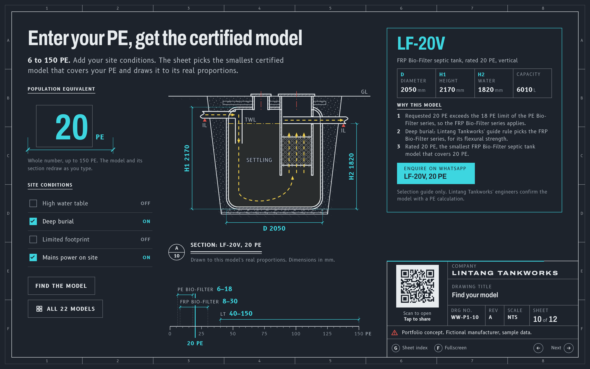
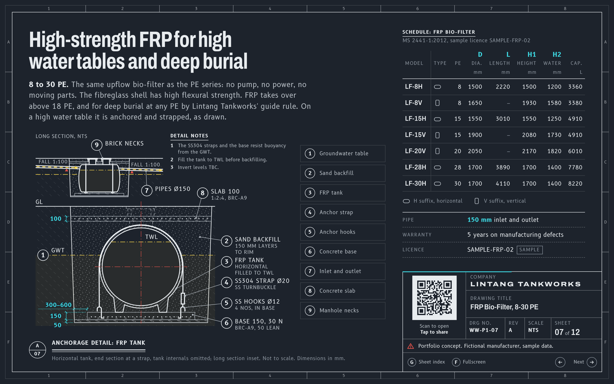
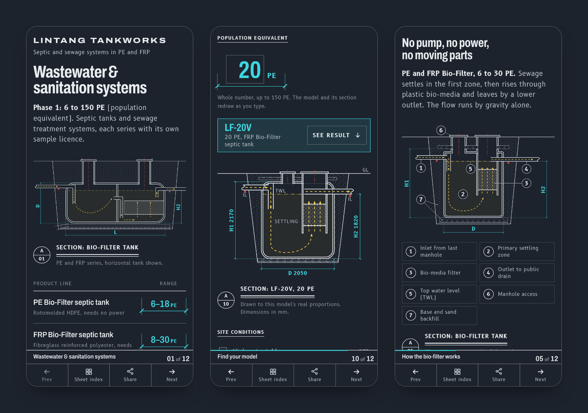

# Lintang Tankworks: a sales deck drawn as CAD sheets

**A 12-sheet interactive deck for a septic and sewage tank maker, drawn the way engineers review
tanks, with a selector that picks the right model and draws it to scale. One offline HTML file.**

> Portfolio concept. Lintang Tankworks is a fictional manufacturer and every figure in the deck is
> sample data (see "About the brand and data" below).

Scope: concept, visual design, technical drawings, front-end build and tests.

## The brief

A Malaysian maker of septic tanks and small sewage treatment systems posted a job on Upwork. Their
sales team was sending PDF brochures over WhatsApp. They wanted an interactive deck instead, for
contractors and engineering consultants: one link that works on a phone on site and on a
meeting-room screen.

Phase 1 covered three product lines from 6 to 150 PE (population equivalent, the number of people a
system serves). The brief asked for Space and arrow-key navigation, a G key for a slide menu, an F key
for fullscreen, touch swipe, and a QR code for sharing, in a dark, high-contrast look.

I built a working concept as part of my proposal. The client hired someone else, so I rebuilt it
around a fictional brand to show here.

## What I built

- **12 drawing sheets:** cover, company, approvals, the product range on one PE scale, how the
  bio-filter works, one sheet per product series, the LT schedule with legal discharge limits, the
  model selector, installation, and contact.
- **"The drawing sheet at night".** Consultants already check tanks as CAD drawings, so every sheet is
  one: a dark model-space ground, sections with wall hatching and dimension strings, a lettered and
  numbered border grid, and a title block holding the drawing number, sheet count, QR code and
  navigation. Colour has a fixed job: cyan for dimensions and anything you can press, yellow for water,
  red for centrelines and warnings.
- **Schematics with moving water.** SVG sections of the bio-filter tank, the fibreglass tank strapped
  down against a high water table, and the aerated LT system. Only the water moves, in the direction
  it really flows, and it stays still when the visitor's device asks for reduced motion. Tapping a
  legend label isolates that part of the drawing.
- **A selector that draws its answer.** Enter a PE and tick the site conditions (high water table,
  deep burial, limited footprint, mains power). The sheet picks the smallest of 22 models that covers
  it, gives its reasons in plain sentences, and redraws the tank section at that model's real
  proportions, with live dimensions. The WhatsApp button then opens an enquiry already filled in with
  the model, the PE and the site conditions.
- **The controls from the brief:** arrow keys, Space, Page Up and Down, Home and End, G for the sheet
  index, F for fullscreen, swipe on phones (tables scroll sideways without changing the sheet), a QR
  code and share dialog, and links that open a given sheet (for example `#10`).
- **One offline file.** Fonts, drawings, the photo, the QR encoder and all the scripts are inlined into
  a single `index.html` of about 700 KB (about 385 KB when the host compresses it). It opens from a
  link, a WhatsApp attachment or straight from disk, and makes no network requests.

## Process

1. **Brief first.** I wrote down the audience, the required controls, the product lines, and what
   was not known (depths below ground, weights, prices), so nothing would be made up later. Unknown
   figures show as "TBC" in the deck.
2. **Visual direction chosen from four rendered options.** I rendered four cover designs: a standard
   dark-navy product deck with cards and icon tiles, a set of approval paperwork, a sewing-pattern
   envelope, and a CAD drawing sheet. The drawing sheet won: it speaks the consultants' own language
   and does not look like every other supplier brochure.
3. **Engine test-first.** Navigation, sheet links, the selector rules, the WhatsApp and QR links and
   the build were written as small modules with unit tests before any visual design. A short written
   contract lists the markup the engine expects, so the design work could not break behaviour.
4. **Drawings checked against source drawings.** Each section was compared with the published
   product and installation drawings the original brief was based on: which side the inlet sits,
   the outlet sitting below the inlet, where the water level falls, how the tank is strapped down.
   Tests check that every schedule on the sheets matches the data file and that all 22 selector
   drawings fit their frame.
5. **Independent design review.** A separate review pass checked every sheet at desktop
   (1440 x 900), laptop (1280 x 800) and phone (390 x 844) sizes. It found labels that were too
   small, all-caps notes, a title block that crowded short laptop screens, and the inlet and outlet
   positions on one drawing. I fixed them and re-captured every sheet; an automated design check
   went from 177 findings to 1 (a known limit of the tool).
6. **Portfolio rebuild.** The brand, model codes, licence numbers and every dimension were replaced
   with fictional ones, and each sheet's title block now says so.

## Tech and quality

- Plain HTML, CSS and JavaScript, no framework. A small Node build script uses esbuild to bundle the
  scripts and styles and inline everything into one `dist/index.html`.
- 241 unit tests (Node's built-in test runner). The engine's logic modules (navigation, selector,
  sharing, QR, tank drawings) sit at 98 to 100% line coverage.
- 41 end-to-end tests in Playwright: keyboard, swipe, the sheet index, fullscreen, selector results,
  WhatsApp links, the QR code, no sideways scrolling, no console errors, and no external requests.
- html-validate with its accessibility rules: no errors. One `h1`, no inline styles.
- Works fully from the keyboard with visible focus, announces each sheet change to screen readers, and
  respects reduced motion.

## About the brand and data

Lintang Tankworks does not exist. Its name, model codes (LP-, LF- and LT-), licence numbers
(SAMPLE-PE-01 and so on) and company facts are invented, and every dimension and capacity comes from
a sizing rule I wrote rather than from any real maker's schedule. The WhatsApp enquiry has no phone
number: WhatsApp asks the visitor who to send it to. The Malaysian standards (MS 2441-1, MS 2441-2,
MS 1228) and the sewage discharge limits are real public documents, cited by name. The site photo on
sheet 02 is a real photo of an unrelated tank, used under its licence.

Credits: Archivo and B612 typefaces (SIL Open Font License). Photo: Project Kei, "Japanese septic
tank", CC BY-SA 4.0, Wikimedia Commons (cropped).
